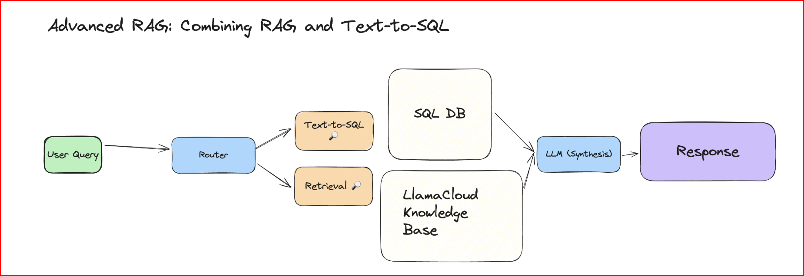
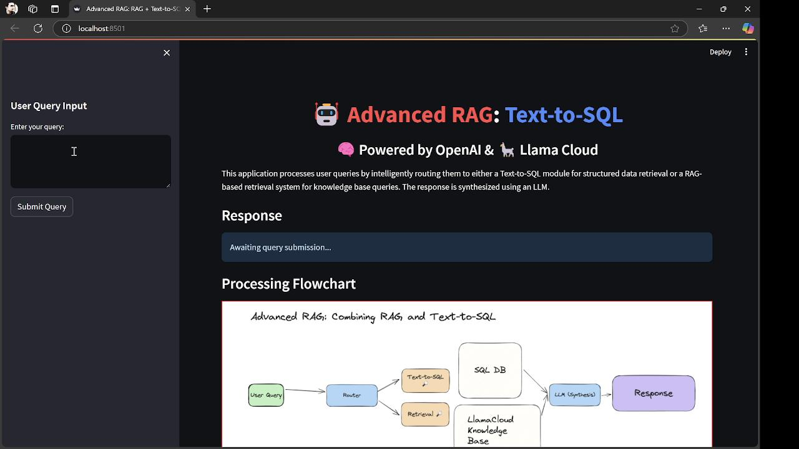
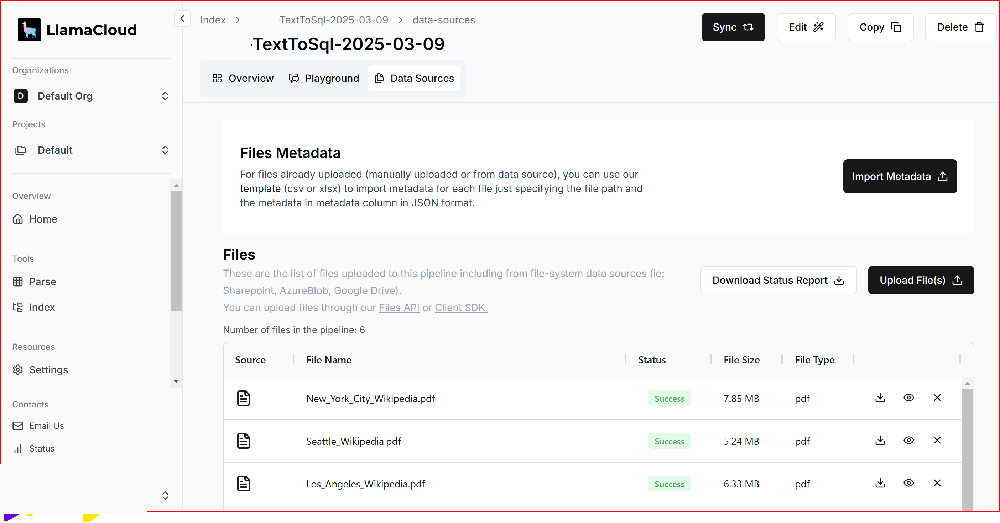

# Combining RAG and Text-to-SQL in a Single Query Interface

This python project shows you how to create a custom agent that can query either your LlamaCloud index for RAG-based retrieval or a separate SQL query engine as a tool. In this example, we'll use PDFs of Wikipedia pages of US cities and a SQL database of their populations and states as documents.



NOTE: Any Text-to-SQL application should be aware that executing arbitrary SQL queries can be a security risk. It is recommended to take precautions as needed, such as using restricted roles, read-only databases, sandboxing, etc.

See the RagBased TextToSql in action:
### 🎥 Video Demo
[](videos/NonFilmora.mkv)


## Installation and Setup
Set up Token keys for OpenAI and Llama Cloud Apis in the .env file. You will find the required code in the config.py

```python
OPENAI_API_KEY=<YOUR OPEN AI TOKEN KEY>
LlamaCloud_TOKEN_KEY=<YOUR LLAMACLOUD TOKEN KEY>
```

### Load Documents into LlamaCloud
Download the following Wikipedia pages into PDFs by either pressing Ctrl-P/Cmd-P or right-clicking and selecting "Print" and then "Save as PDF" as the destination.

-New York City
-Los Angeles
-Chicago
-Houston
-Miami
-Seattle

After that, create a new index in LlamaCloud and upload your PDFs.For this you need to create an account in LlamaCloud and create the index using your OpenAi key or by selecting any other LLM model.




### Install Dependencies
Ensure you have Python 3.11 or later installed
```python
pip install -u requirements.txt
```

### Run the streamlit app
Run the app by running the following command:
```python
streamlit run TextToSql.py
```


### SQL Database
The SQL database in this example will be created in memory and will contain three columns: the city name, the city's population, and the state the city is located in. The table creation and the information for each city is shown in the snippets below.

```python
from sqlalchemy import create_engine, MetaData, Table, Column, String, Integer, insert

# Initialize the SQLite database engine
engine = create_engine("sqlite:///:memory:", future=True)
metadata_obj = MetaData()

# Define city statistics table
table_name = "city_stats"
city_stats_table = Table(
    table_name,
    metadata_obj,
    Column("city_name", String(16), primary_key=True),
    Column("population", Integer),
    Column("state", String(16), nullable=False),
)

# Create the table
metadata_obj.create_all(engine)

# Insert initial data
rows = [
    {"city_name": "New York City", "population": 8336000, "state": "New York"},
    {"city_name": "Los Angeles", "population": 3822000, "state": "California"},
    {"city_name": "Chicago", "population": 2665000, "state": "Illinois"},
    {"city_name": "Houston", "population": 2303000, "state": "Texas"},
    {"city_name": "Miami", "population": 449514, "state": "Florida"},
    {"city_name": "Seattle", "population": 749256, "state": "Washington"},
]
for row in rows:
    stmt = insert(city_stats_table).values(**row)
    with engine.begin() as connection:
        connection.execute(stmt)

def get_database_engine():
    """Returns the database engine instance."""
    return engine
```

Create a query engine based on SQL database.

```python
from llama_index.core.query_engine import NLSQLTableQueryEngine

sql_database = SQLDatabase(engine, include_tables=["city_stats"])
sql_query_engine = NLSQLTableQueryEngine(
    sql_database=sql_database,
    tables=["city_stats"]
)
```
### LlamaCloud Index
Create an index and a query engine around the index you've created.

```python
from llama_index.indices.managed.llama_cloud import LlamaCloudIndex

index = LlamaCloudIndex(
    name="<Your Index Name>", 
    project_name="<Your Project Name>",
    organization_id="<Your Org ID>",
    api_key="<Your API Key>"
)

llama_cloud_query_engine = index.as_query_engine()
```

Create a query engine tool around these query engines.

```python
from llama_index.core.tools import QueryEngineTool

sql_tool = QueryEngineTool.from_defaults(
    query_engine=sql_query_engine,
    description=(
        "Useful for translating a natural language query into a SQL query over"
        " a table containing: city_stats, containing the population/state of"
        " each city located in the USA."
    ),
    name="sql_tool"
)

cities = ["New York City", "Los Angeles", "Chicago", "Houston", "Miami", "Seattle"]
llama_cloud_tool = QueryEngineTool.from_defaults(
    query_engine=llama_cloud_query_engine,
    description=(
        f"Useful for answering semantic questions about certain cities in the US."
    ),
    name="llama_cloud_tool"
)
```

### Creating an Agent Around the Query Engines
We'll create a workflow that acts as an agent around the two query engines. In this workflow, we need four events:

-GatherToolsEvent: Gets all tools that need to be called (which is determined by the LLM).
-ToolCallEvent: An individual tool call. Multiple of these events will be triggered at the same time.
-ToolCallEventResult: Gets result from a tool call.
-GatherEvent: Returned from dispatcher that triggers the ToolCallEvent.

This workflow consists of the following steps:

-chat(): Appends the message to the chat history. This chat history is fed into the LLM, along with the given tools, and the LLM determines which tools to call. This returns a GatherToolsEvent.
-dispatch_calls(): Triggers a ToolCallEvent for each tool call given in the GatherToolsEvent     using send_event().Returns a GatherEvent with the number of tool calls.
-call_tool(): Calls an individual tool. This step will run multiple times if there is more than one tool call. This step calls the tool and appends the result as a chat message to the chat history. It returns a ToolCallEventResult with the result of the tool call.
-gather(): Gathers the results from all tool calls using collect_events(). Waits for all tool calls to finish, then feeds chat history (following all tool calls) into the LLM. Returns the response from the LLM.

Create the workflow instance.

```python
wf = RouterOutputAgentWorkflow(tools=[sql_tool, llama_cloud_tool], verbose=True, timeout=120)
```

Visualize Workflow

```python
from llama_index.utils.workflow import draw_all_possible_flows
draw_all_possible_flows(RouterOutputAgentWorkflow)
```

### Example Queries
```python
from IPython.display import display, Markdown
result = await wf.run(message="Which city has the highest population?")
display(Markdown(result))
```
```python
Running step prepare_chat
Step prepare_chat produced event InputEvent
Running step chat
Chat message: None
Step chat produced event GatherToolsEvent
Running step dispatch_calls
Step dispatch_calls produced no event
Running step call_tool
Calling function sql_tool with msg {'input': 'SELECT city FROM city_stats ORDER BY population DESC LIMIT 1'}
Step call_tool produced event ToolCallEventResult
Running step gather
Step gather produced event InputEvent
Running step chat
Chat message: New York City has the highest population.
Step chat produced event StopEvent
New York City has the highest population.
```


