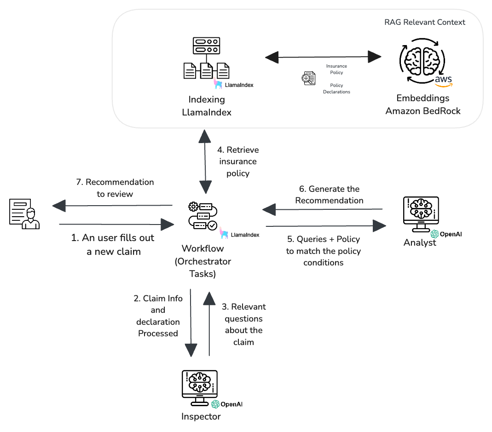

# Insurance Claim Workflow
> Automatizing claims by using IA tools

This application implements a workflow to validate insurance claims against policies and generate case-specific recommendations. The design is based on the LlamaCloud demo 
available at this [link](https://shorturl.at/xIwEv). I have developed several classes and applied quick fixes to enhance the quality of the generated responses.

## Initial Configuration

In this repository, you'll find a requirements file listing the libraries you need to install to ensure the project runs smoothly. Additionally, you will need to set up 
some indexes and obtain an OpenAI API key to integrate the agents.

For this implementation, I configured my indexes using LlamaCloud and Amazon Bedrock, and set up the LLM to generate queries and recommendations with OpenAI.

Below are some helpful links to guide you through configuring the necessary tools for running the project:

1. [Llama Index](https://docs.cloud.llamaindex.ai/llamacloud/getting_started/quick_start)
2. [Amazon Bedrock Embeddings](https://docs.aws.amazon.com/bedrock/latest/userguide/titan-embedding-models.html)
3. [OpenAI API](https://openai.com/api/)

In each case, you'll find tests included to ensure everything is functioning correctly. I recommend reviewing all the provided links and taking the time to 
thoroughly test each solution.

## Running the project

1. Start by cloning the project repository to your local machine.

```shell
git clone https://github.com/germanpenna/autoinsurance.git
cd autoinsurance/
```

2. The insuranceApp.py file is where you'll need to add your API keys and tokens for the necessary tools. Review the code to identify the specific variables that 
need to be configured.

3. I’ve structured the project into a package to streamline the setup process and ensure a smooth deployment.

### Setup and Running

1. Replace the keys for your policy index in the insuranceApp file as mentioned in this block.

```python
#Configure your index in Llama and add the parameters as stated after setting up.
#You can also use another Open Source solutions such as Qdrant
name="...", 
project_name="...",
organization_id="...",
api_key="..."
```

2. Repeat the same process to initialize the index of declarations

```python
#Configure your index in Llama and add the parameters as stated after setting up.
#You can also use another Open Source solutions such as Qdrant
name="...", 
project_name="...",
organization_id="...",
api_key="..."
```

3. Configure the token to access to LlamaCloud. You can use a environment variable as suggested in the code

```python
base_url="...",
token=os.environ["LLAMA_CLOUD_API_KEY"],
```

4. Finally, you will need a API for OpenAI. Setting it up as a environment variable.

```python
api_key=os.environ["OPEN_API_KEY"]
```

That's all! You are ready to go. Take into account that you can always find Open Source options or other third parties providers. You can use them. Just set the indexes
and keys, and check any additional requirement you eventually need to set this up.

To run the project, in the console, run the next command

```shell
python -m streamlit run insuranceApp.py
```

### Pachage Claim

The package contains two classes documents and insurance:

1. Documents. This class takes the LlamaCloud indexes to retrieve any query related to the insurance policy and the declarations in every claim.
2. AutoInsuranceWorkflow. This class includes the workflow with the tasks to process the claims, generate the queries about the case and final recommendations.

See below a diagram that illustrates how it works.



## Features

You can try different use cases. The way that this is structured, let you work with different use cases. For example, if you want to match a credit risk application
against a credit risk policy, you can create both indexes (credit risk policy and aplications). Or probably, pre-screen and generate a investmet recommendation with
its nuances and limitations, aso create both indexes. Think about this project beyond the code and the agents and think about real use cases where you can apply
this.

In this case the general project runs as described below:

1. Generate the claim info. If you change the scope, make sure to modify the claim structure to validate in the code.
2. Set up two indexes for policy and declarations. In your case, declarations could be a credit risk application or an additional analysis of a investor. It's the
additional context that we used to generate the queries against the policy.
3. Run the workflow to generate the recommenations.

[Demo App](https://github.com/germanpenna/autoinsurance/blob/main/assets/DemoApp.mov)

## Contributing

I encourage and welcome contributions from the community! If you'd like to contribute to the project, please follow these steps:

1. Fork the repository: Begin by forking the repository to your own GitHub account. This allows you to work on your proposed 
changes without affecting the main project.

2. Create a feature branch: After forking, create a new branch for the feature or fix you'd like to work on. This ensures that your 
changes are isolated and easy to review.

3. Make your changes: Implement your improvements, bug fixes, or new features within your feature branch. Be sure to write clear, concise 
commit messages explaining the changes you've made.

4. Submit a pull request: Once you're satisfied with your changes, submit a pull request to the main repository. I highly encourage 
submitting well-documented pull requests with clear descriptions of the changes and their purpose.

I appreciate all contributions, whether big or small. Every improvement helps make the project better!

## Links

This project was developed thanks to the reccomendations of [Daily Doses of DS](https://www.dailydoseofds.com/) . Please check the amazing
tutorials and material they post every week. 
