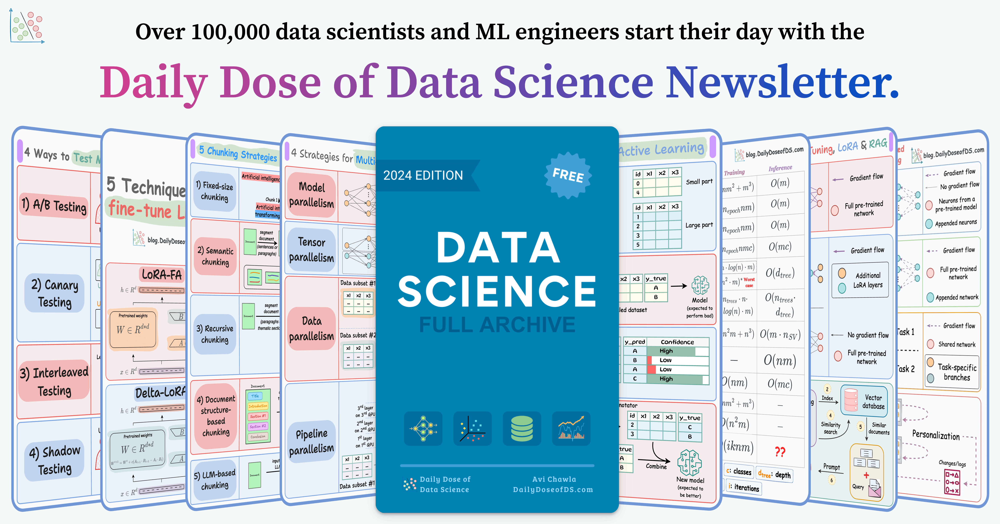

# Chat with Your Database Using RAG  

This project allows you to query your database using natural language with Retrieval-Augmented Generation (RAG).  

We use:  
- **Ollama** for running a local LLM.  
- **LlamaIndex** for handling query processing.  
- **Qdrant VectorDB** for storing embeddings.  
- **Streamlit** for the user interface.  

## 📽️ Demo  

  

## 🛠 Installation and Setup  

### 1. Install Ollama  

Ollama is required to run the LLM locally. Install it from: [Ollama](https://ollama.com).  

### 2. Setup Qdrant VectorDB  

Run Qdrant locally using Docker:  

```bash
docker run -p 6333:6333 -p 6334:6334 \
-v $(pwd)/qdrant_storage:/qdrant/storage:z \
qdrant/qdrant
```  

### 3. Install Dependencies  

Ensure you have **Python 3.11 or later**, then install the required packages:  

```bash
pip install streamlit llama-index-core \
llama-index-llms-ollama \
llama-index-embeddings-huggingface \
llama-index-vector-stores-qdrant \
qdrant-client sqlalchemy
```  

### 4. Run the App  

Start the Streamlit app:  

```bash
streamlit run app.py
```  

## 📬 Stay Updated with Our Newsletter!

Get a FREE Data Science eBook 📖 with 150+ essential lessons in Data Science when you subscribe to our newsletter! Stay in the loop with the latest tutorials, insights, and exclusive resources. [Subscribe now!](https://join.dailydoseofds.com/)

  

## 🤝 Contribution  

Contributions are welcome! Please fork the repository and submit a pull request with your improvements.  
