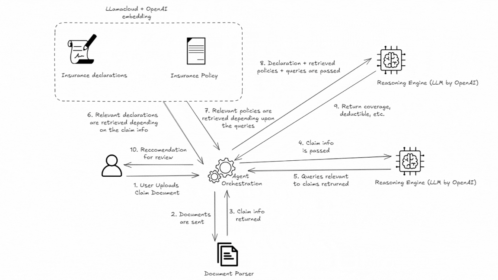
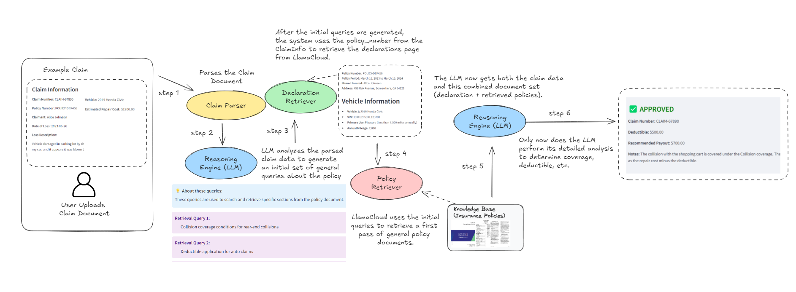
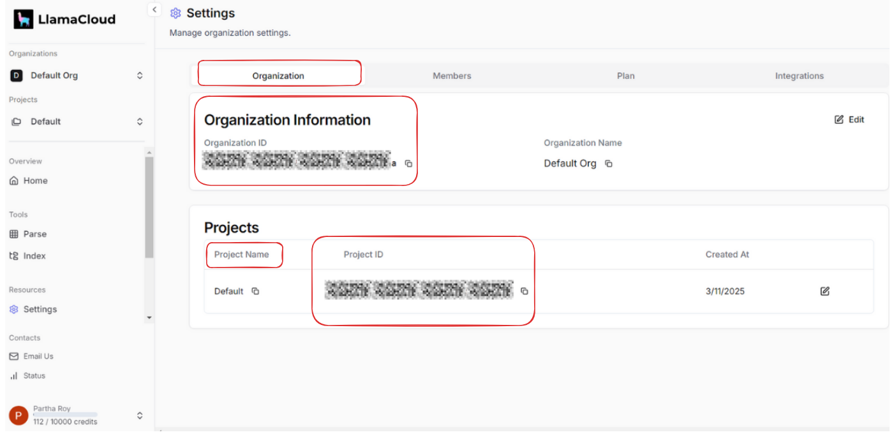
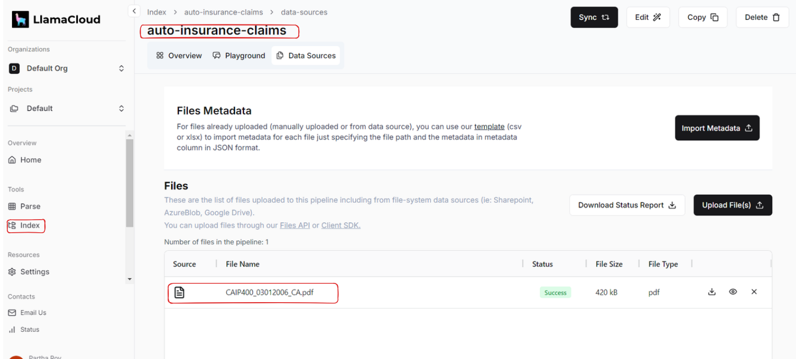
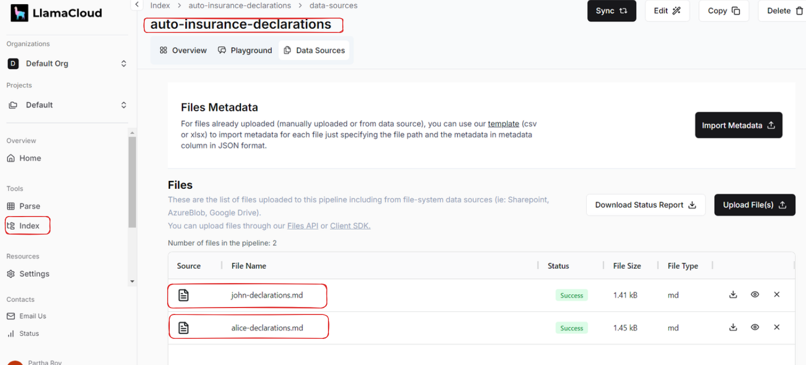

# Auto Insurance Claim Processor

An AI-powered application for processing auto insurance claims using Large Language Models (LLMs) and vector search, developed by Parth.


## Project Overview

This application builds an automated insurance claim processing workflow that:

- Analyzes insurance claim information
- Retrieves relevant policy information using vector search
- Determines coverage eligibility based on policy documents
- Presents results through an interactive Streamlit UI

### Architecture



## Features

- **Claim Processing**: Analyze insurance claims and determine coverage eligibility
- **Policy Document Retrieval**: Efficiently search through insurance policies and declarations using vector search
- **Document Parsing**: Extract information from PDF policy documents
- **LlamaCloud Integration**: Store and retrieve documents using LlamaCloud's document management
- **Workflow Visualization**: Visualize the claim processing workflow
- **LLM Support**: Works with OpenAI



## Installation

### Requirements

- Python 3.11 or higher
- A valid [LlamaCloud API key](https://cloud.llamaindex.ai/)
- A valid [OpenAI API key](https://platform.openai.com/api-keys)
- A valid [LlamaCloud Org id](https://cloud.llamaindex.ai/)

### Setup Options

#### Option 1: Standard Python Setup

1. Clone the repository:

```bash
git clone https://github.com/patchy631/ai-engineering-hub.git
cd auto-insurance-agent
```

2. Create a virtual environment:

```bash
python -m venv venv
```

3. Activate the virtual environment:

   On Windows:

   ```bash
   venv\Scripts\activate
   ```

   On macOS/Linux:

   ```bash
   source venv/bin/activate
   ```

4. Install dependencies:

```bash
pip install -r requirements.txt
```

#### Option 2: Setup with uv

[uv](https://github.com/astral-sh/uv) is a fast Python package installer and resolver that can speed up dependency installation.

1. Clone the repository:

```bash
git clone https://github.com/patchy631/ai-engineering-hub.git
cd auto-insurance-agent
```

2. Create a virtual environment and install dependencies with uv:

```bash
uv venv
source .venv/bin/activate  # On Windows: .venv\Scripts\activate
uv pip install -r requirements.txt
```

### Environment Configuration

Create a `.env` file in the project root with the following:

```env
OPENAI_API_KEY = "your_openai_api_key"
LLAMA_CLOUD_ORG_ID = "your_organization_id_here"
LLAMA_CLOUD_API_KEY = "your_llama_cloud_api_key"
```

### Project Structure

```text
auto-insurance-agent/
├── data/                  # Sample insurance policy data
│   ├── alice-declarations.md
│   ├── alice.json
│   ├── john-declarations.md
│   └── john.json
├── img/                   # Images for documentation
│   ├── demo.gif
|   ├── detail-workflow.png
|   ├── flow.gif
|   ├── llamaindex-claim-index.png
│   ├── llamaindex-declarations-index.png
│   └── llamaindex-project-and-org.png
├── src/                   # Application source code
│   ├── init__.py          # Main application entry point
│   ├── models/            # Data models
│   │   └── schemas.py
│   ├── ui/                # User interface components
│   │   └── components.py
│   ├── utils/             # Utility functions
│   │   └── helpers.py
│   └── workflow/          # Workflow implementation
│       ├── events.py
│       └── workflow.py
├── app.py
├── pyproject.toml         # Project metadata and dependencies
├── requirements.txt       # Project dependencies
├── uv.lock                # Lock file for uv dependencies
└── README.md              # Project documentation
```

## LlamaCloud Configuration

1. Log into [LlamaCloud](https://cloud.llamaindex.ai/)
2. Navigate to **Settings** > **Organization** > **Organization ID** to get your `LLAMA_ORG_ID`
3. Create a new project and set the name to match the `project_name` in your code
4. Create two new indexes:
   - Load the `.md` files from the `data/` folder and name the index `auto_insurance_declarations`
   - Load the `.json` files from the `data/` folder and name the index `auto-insurance-claims`
5. Upload and parse the reference [PDF file](https://nationalgeneral.com/forms_catalog/CAIP400_03012006_CA.pdf)





## Running the Application

To start the application:

```bash
streamlit run app.py
```

Navigate to the URL shown in the terminal (typically [http://localhost:8501](http://localhost:8501)) to access the interface.

## Usage

1. The application presents an intuitive interface for processing auto insurance claims
2. Upload or enter claim information in the appropriate fields
3. The system will analyze the claim against relevant policy documents
4. Review the results and coverage determination

## License

This project is licensed under the MIT License - see the LICENSE file for details.

## Acknowledgements

- [LlamaIndex](https://www.llamaindex.ai/) for document indexing capabilities
- [OpenAI](https://openai.com/) for language model integration
- [Streamlit](https://streamlit.io/) for the web interface

For more information, see the [Twitter/X Thread](https://typefully.com/t/5fBXdnm).
