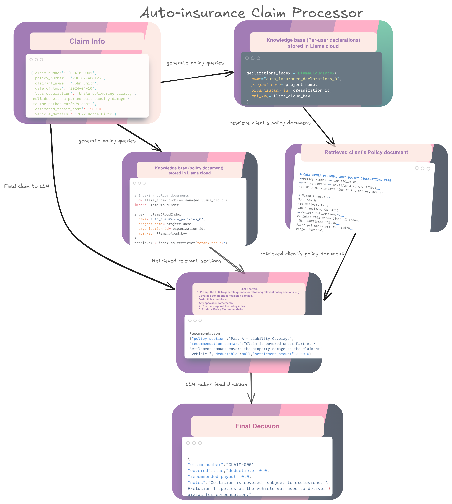

# Auto Insurance Claim Processor

This application processes auto insurance claims using LlamaIndex and Gemini LLM. It can be run as a command-line tool or as a Streamlit web application.

## Setup

1. Clone this repository
2. Install the required dependencies:
   ```
   pip install -r requirements.txt
   ```
3. Copy the `.env.example` file to `.env` and fill in your API keys:
   ```
   cp .env.example .env
   ```
4. Edit the `.env` file with your actual API keys and configuration

## Required API Keys

- **Google API Key** for Gemini LLM
- **LlamaCloud API Key** for vector database access
- **Project Name** for your LlamaCloud project
- **Organization ID** for your LlamaCloud organization

## Directory Structure

Make sure you have a `data` directory with sample claim JSON files:

```
data/
  john.json
  alice.json
  # ... other claim files
```

## Running the Command Line Tool

Test a claim from the command line:

```
python test_workflow.py --file data/john.json
```

## Running the Streamlit Web App

Start the Streamlit app:

```
streamlit run app.py
```

The app will be available at `http://localhost:8501`

## Features

- Process claims from JSON files
- Manual claim entry form
- View processing logs
- View claim decisions with coverage, deductible, and payout information

## Sample Claim JSON Format

```json
{
  "claim_number": "CL1234567",
  "policy_number": "POL987654",
  "claimant_name": "John Doe",
  "date_of_loss": "2023-11-15",
  "loss_description": "Rear-end collision at stop light",
  "estimated_repair_cost": 3500.00,
  "vehicle_details": "2018 Honda Accord, VIN: 1HGCV1F34JA123456"
}
```
## Sample claim decision

```json
{
"claim_number":"CLAIM-0001"
"covered":true
"deductible":0
"recommended_payout":0
"notes":"Collision is covered, subject to exclusions. Exclusion 1 applies as the vehicle was used to deliver pizzas for compensation."
}
```