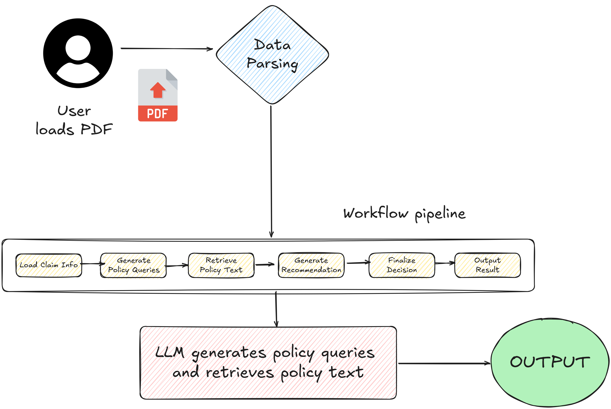
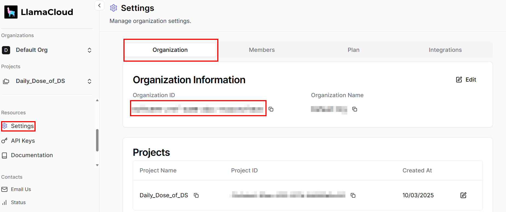
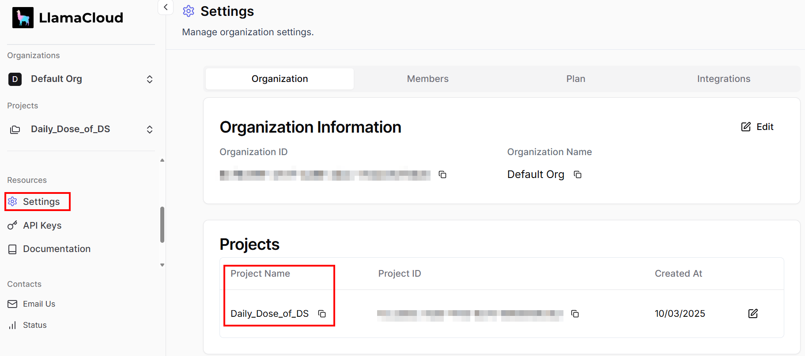
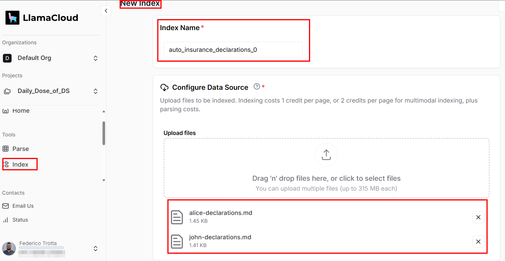
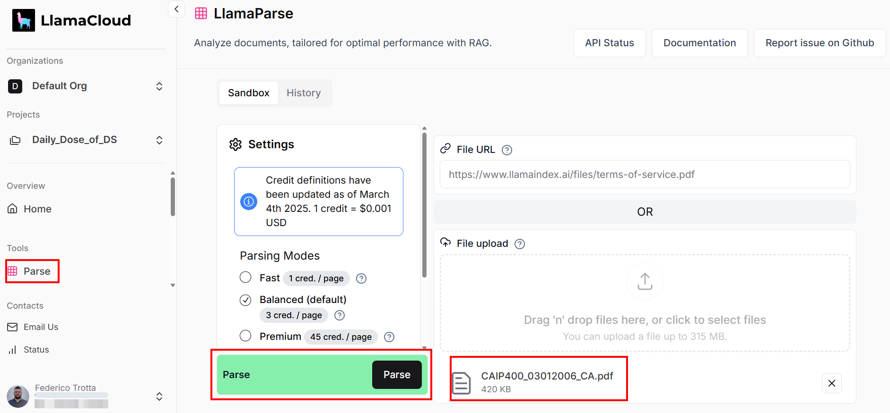

#  Insurance Claim Workflow by Federico Trotta
This project builds an auto insurance claim processing workflow. The image below shows the running application:


Note that the loading of the PDF file is simulated: the actual data management is done via cloudllama as per how it is specified [here](https://github.com/run-llama/llamacloud-demo/blob/main/examples/document_workflows/auto_insurance_claims/auto_insurance_claims.ipynb) in the section "Indexing Policy Documents" and below in the [Project set up: cloudllama](#project-set-up-cloudllama) section.

Here is the architecture of the workflow:

 

Look at the Twitter/X Thread Draft [here](https://typefully.com/_FedericoTrotta/zxEdoDd).

## Installation

### Requirements
To replicate this tutorial must match the following requirements:
- Python 3.10.1 or higher installed on your machine.
- A valid coludllama API key that can be retrieved [here](https://cloud.llamaindex.ai/).
- A valid OpenAI API key that can be retrieved [here](https://platform.openai.com/api-keys).

### Prerequisites
Suppose you call the main folder of your project `insurance_claim/`. At the end of this step, the folder will have the following structure:
```plaintext
insurance_claim/
    ├── data/
    ├── venv/
    ├── src/
    ├── app.py
    ├── .env
    └── requirements.txt
```

Where:
- `data/` contains files to insert into [cloudllama](#project-set-up-cloudllama).
- `venv/` contains the virtual environment.
- `src/` contains all the Python modules to import into the main file which is called `app.py`.
- `app.py` is the main Python file of the project.
- `requirements.txt` is the file coitaining the requirements to install.
- `.env` is the file cointaining the the environment variables with the values of your API keys.

You can create the venv/ virtual environment directory like so:
```plaintext
python3 -m venv venv
```
To activate it, on Windows, run:
```plaintext
venv\Scripts\activate
```

Equivalently, on macOS and Linux, execute:
```plaintext
source venv/bin/activate
```

You can now install dependencies:
```plaintext
pip install -r requirements.txt
```

The credentials can be set into the `.env` file like so:
```plaintext
OPENAI_API_KEY = ""
LLAMA_ORG_ID = ""
LLAMA_API_KEY= ""
```

The [Project set up: cloudllama](#project-set-up-cloudllama) section discusses how to set and retrieve their values.

### Project set up: cloudllama
In cloudllama, do the following:
- In [cloudllama](https://cloud.llamaindex.ai/), the `LLAMA_ORG_ID` go to **Settings** > **Organization** > **Organization ID**. The value of **Organization ID** is the one you have to set for `LLAMA_ORG_ID`.

 

- Still in **Settings**, give a name to **Project Name** under the **Projects** table. This must be the same value as the variable `project_name` of the `LlamaCloudIndex()` method.



- Copy and paste the `.json` and `.md` files you find in the `data/` folder of this repository as new indexes in cloudllama. To do so, in the section **Index** click on **Create index** and drag and drop the two `.md` files and name the index as `auto_insurance_declarations_0`. Do the same for the two `.json` files and name the index as `auto_insurance_policies_0`.



- Download the reference PDF file from [here](https://nationalgeneral.com/forms_catalog/CAIP400_03012006_CA.pdf) and load it in the **Parse**. Then, click on **Parse**.



Note that the project has been named as `Daily_Dose_of_DS`. You can rename the project later after loading. Also, this must be the name of the variable `project_name` of the methods `index = LlamaCloudIndex()` and `declarations_index = LlamaCloudIndex()` you find in the `indices.py` file inside the src/ folder.

## Run the application
To run the application, type:
```plaintext
streamlit run app.py
```