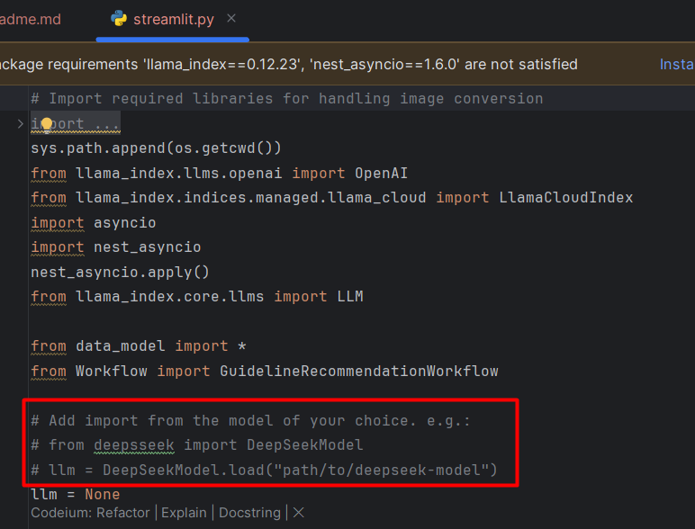

# Patient Case Summary
This project creates a patient case summary based on the latest medical guidelines.

## Installation and setup

---

**Setting LLamaIndex Account:**

Go to https://cloud.llamaindex.ai/ and create an account. 
Then go to "Index" and create a new index and upload the medical guidelines. Collect the information of the Index (Name, ID, and Project name) to introduce it later in the UI.
Finally, go API Keys (in Resources) and create and store in a safe place your API Key. You will not be able to recover it later!

**Configure OpenAI API:**

Go to https://platform.openai.com/ and create an account. You will need to put resources (e.g.:money) to interact with the API.  
Then go to "API Keys" and create and store in a safe place your API Key. You will not be able to recover it later!

You can also use an Open Source LLMs like Llama, DeepSeek... but in this case you will have to download it and install it in your computer.
Below you have a screen capture of what is to be uncommented in the streamlit code to modify the LLM used.



**Create virtual environment (python3.11)**

Next step is to create the virtual environment for python3.11 and install the libraries needed to run the code.

```bash
   python3.11 -m venv venv
   ```
```bash
   Source venv/bin/activate
   ```
```bash
   pip install -r requirements.txt
   ```

**Run the app**
    
Finally, with the venv loaded you can run the app by introducing the following command:
    
```bash
   python -m main
   ```

---
## 📬 Stay Updated with Our Newsletter!
**Get a FREE Data Science eBook** 📖 with 150+ essential lessons in Data Science when you subscribe to our newsletter! Stay in the loop with the latest tutorials, insights, and exclusive resources. [Subscribe now!](https://join.dailydoseofds.com)

[](https://join.dailydoseofds.com)

---

## Contribution

Contributions are welcome! Please fork the repository and submit a pull request with your improvements.