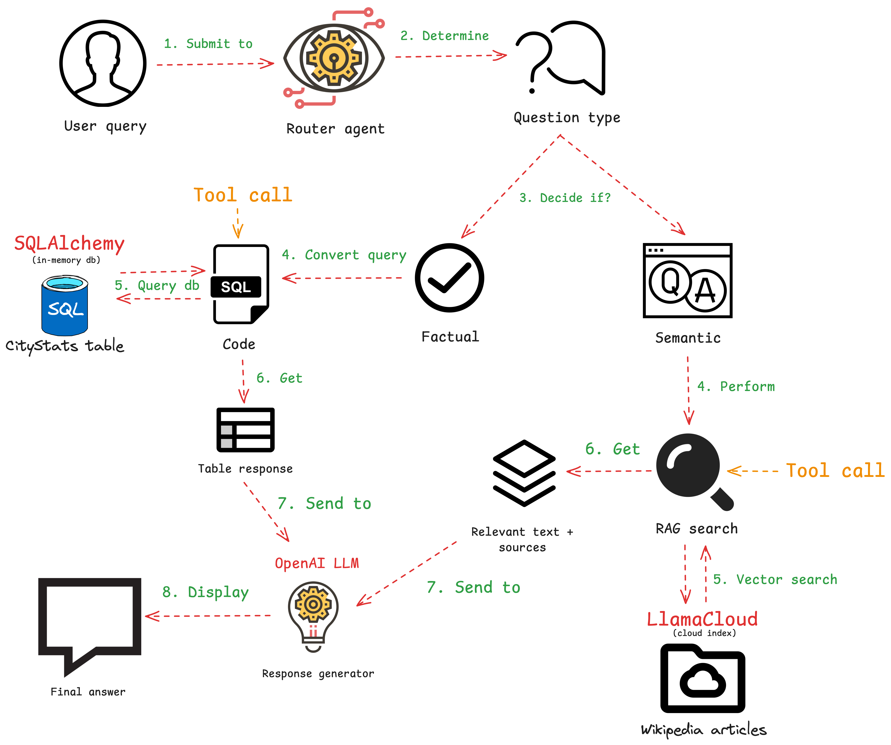

# RAG-SQL Assistant

A powerful application that combines Retrieval-Augmented Generation (RAG) and Text-to-SQL capabilities in a single interface.

This project allows you to:

- Ask questions in natural language about city data
- Get direct SQL query results for structured questions
- Retrieve knowledge from documents for informational questions
- Experience intelligent query routing based on question intent

## Demo

[Insert Video or GIF Demo Here]

## Features

- 🧠 **Intelligent Query Routing**: Automatically determines whether to use RAG or SQL based on query type
- 📊 **SQL Query Generation**: Translates natural language to SQL for database queries
- 📚 **Document Retrieval**: Finds relevant information from documents for knowledge-based questions
- 💬 **Intuitive Chat Interface**: User-friendly Streamlit UI for conversation
- 🔄 **Workflow Visualization**: Clear indication of which system (RAG or SQL) is used for each query

## Architecture

The RAG-SQL Assistant uses the following technologies:

- **LlamaIndex**: Provides the workflow engine, RAG capabilities, and tool routing
- **SQLAlchemy**: Handles database connection and SQL query execution
- **Streamlit**: Powers the user interface
- **OpenAI**: Drives the natural language understanding



## Installation and Setup

### Prerequisites

- Python 3.9+
- OpenAI API key

### Set Up Environment

1. Clone this repository:

   ```bash
   git clone https://github.com/your-username/rag-sql-assistant.git
   cd rag-sql-assistant
   ```

2. Install dependencies:

   ```bash
   pip install -r requirements.txt
   ```

3. Set up your environment variables:
   - Copy `.env.example` to `.env`
   - Add your OpenAI API key and other required credentials:

   ```
   OPENAI_API_KEY=your_openai_api_key
   LLAMA_CLOUD_API_KEY=your_llama_cloud_api_key
   LLAMA_CLOUD_ORG_ID=your_org_id
   LLAMA_CLOUD_PROJECT=your_project_name
   LLAMA_CLOUD_INDEX=your_index_name
   ```

### Creating Diagram Assets

The application expects diagram assets to be in the `assets` directory. Before running the application, you should create:

1. Architecture diagram (`assets/architecture.png`) - Shows how the components fit together
2. Workflow diagram (`assets/workflow.png`) - Illustrates the query processing flow
3. DDODS banner (`assets/ddods_banner.png`) - Banner for Daily Dose of Data Science

You can create these diagrams using [Excalidraw](https://excalidraw.com/) as recommended in the assignment brief.

If these images are not available, the application will display ASCII diagrams instead.

### Running the Application

Run the Streamlit app:

```bash
streamlit run app.py
```

The app will be available at <http://localhost:8501>

## Usage Examples

### SQL Queries

- "What is the population of New York City?"
- "List the top 5 most populous cities in California."
- "What is the average population of cities in Texas?"

### RAG Queries

- "Tell me about the history of Chicago."
- "What are the major landmarks in Boston?"
- "Explain the climate patterns in Seattle."

## How It Works

The system uses a router workflow to analyze each query and determine whether it should be processed using SQL or RAG:

1. **Query Analysis**: An LLM evaluates the query to determine its intent
2. **Tool Selection**: Based on the intent, either the SQL or RAG tool is selected
3. **Query Execution**: The appropriate system processes the query
4. **Response Generation**: Results are formatted and presented to the user


## Project Structure

```
rag-sql-assistant/
├── app.py                 # Main Streamlit application
├── requirements.txt       # Python dependencies
├── .env.example           # Example environment variables
├── assets/                # Images and other assets
└── src/
    ├── router/            # Query routing logic
    │   ├── workflow.py    # Router workflow implementation
    │   └── tools.py       # SQL and RAG tools
    ├── database/          # Database components
    │   └── city_stats.py  # City statistics database
    ├── rag/               # RAG components
    │   └── cloud_index.py # LlamaCloud RAG implementation
    ├── ui/                # UI components
    │   ├── chat.py        # Chat interface
    │   └── explainer.py   # Explainer section
    └── config.py          # Configuration utilities
```

## Preparing for the Twitter Thread

After setting up and testing the application, follow these steps to prepare your Twitter thread:

1. Create code screenshots using [Snappify](https://snappify.com/)
2. Export diagrams from Excalidraw
3. Draft your Twitter thread following this structure:
   - Tweet 1: Introduce what you're building
   - Tweet 2: Show a demo or screenshot of the final result
   - Tweet 3: Explain the implementation with a diagram
   - Tweets 4+: Show code snippets highlighting key aspects
   - Final tweets: Conclusion and call to action

Remember to keep each tweet under 280 characters and to focus on the core technologies, not the Streamlit UI code.

---

## 📬 Stay Updated with Daily Dose of Data Science

**Get a FREE Data Science eBook** 📖 with 150+ essential lessons in Data Science when you subscribe to our newsletter! Stay in the loop with the latest tutorials, insights, and exclusive resources.

[Subscribe now!](https://join.dailydoseofds.com)


---

## Contribution

Contributions are welcome! Please fork the repository and submit a pull request with your improvements.
