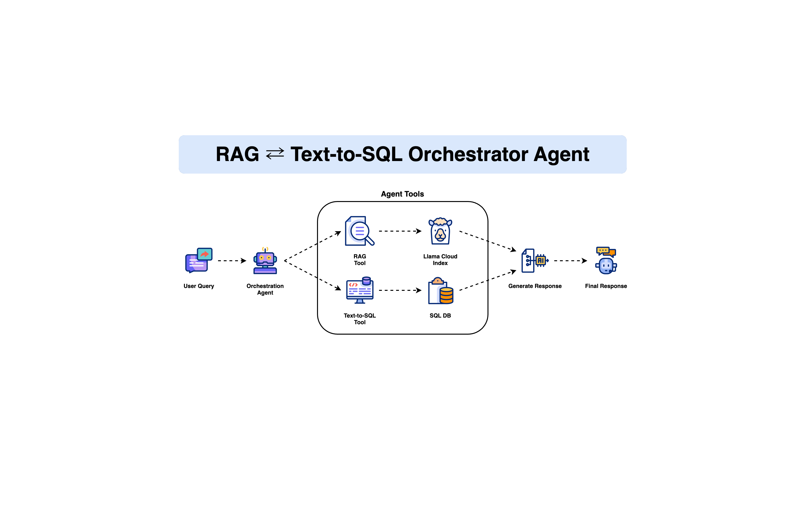

# RAG and Text-to-SQL Orchestration Agent



This project builds an orchestration agent that choose suitable tools between RAG and Text-to-SQL to generate response.
We use:
- OpenAI GPT-3.5-Turbo for LLM.
- LlamaIndex for orchestration, RAG, and Text-to-SQL.
- SQLAlchemy for SQL Database Engine.
- Streamlit to build the UI.

A demo is shown below:

[Video demo](assets/demo.mov)

## Installation and setup

**Setup OpenAI**:

Get an API key from [OpenAI](https://platform.openai.com/api-keys), input the API key in Streamlit UI after running the app.

**Setup LlamaCloud**:

Get an API key from [LlamaCloud](https://cloud.llamaindex.ai), input the API key in Streamlit UI after running the app.

Download the following Wikipedia pages into PDFs by either pressing Ctrl-P/Cmd-P or right-clicking and selecting "Print" and then "Save as PDF" as the destination.
- [New York City](https://en.wikipedia.org/wiki/New_York_City)
- [Los Angeles](https://en.wikipedia.org/wiki/Los_Angeles)
- [Chicago](https://en.wikipedia.org/wiki/Chicago)
- [Houston](https://en.wikipedia.org/wiki/Houston)
- [Miami](https://en.wikipedia.org/wiki/Miami)
- [Seattle](https://en.wikipedia.org/wiki/Seattle)

After that, create a new index in [LlamaCloud](https://cloud.llamaindex.ai) and upload your PDFs.

**Install Dependencies**:
   Ensure you have Python 3.11 or later installed.
   ```bash
   pip install streamlit llama-index
   ```

**Run the app**:

   Run the app by running the following command:

   ```bash
   streamlit run app.py
   ```

---

## 📬 Stay Updated with Our Newsletter!
**Get a FREE Data Science eBook** 📖 with 150+ essential lessons in Data Science when you subscribe to our newsletter! Stay in the loop with the latest tutorials, insights, and exclusive resources. [Subscribe now!](https://join.dailydoseofds.com)

[](https://join.dailydoseofds.com)

---

## Contribution

Contributions are welcome! Please fork the repository and submit a pull request with your improvements.
